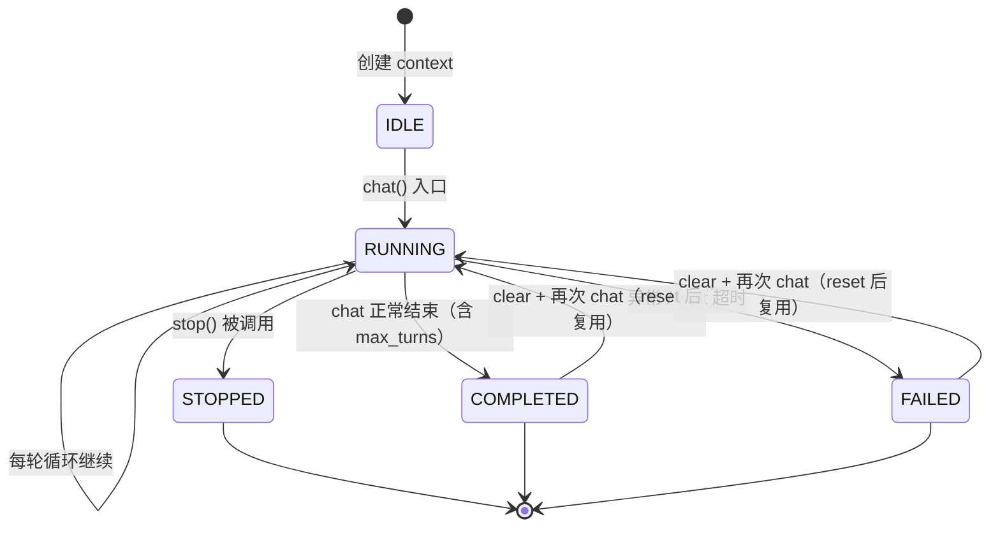
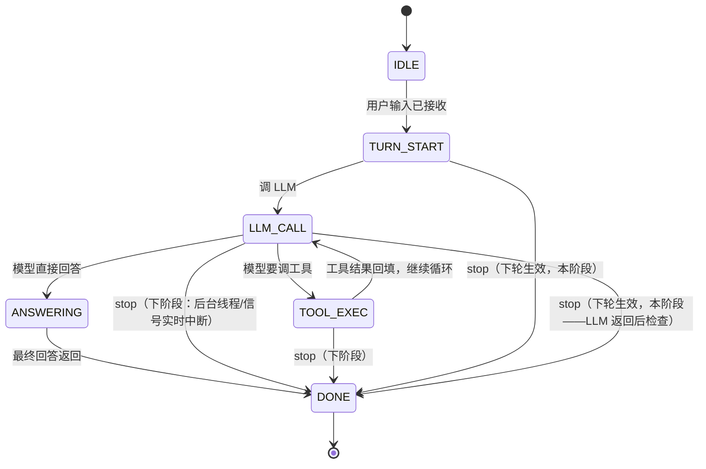

# AgentManager 统一控制台方案（主 agent 接入 + 控制面统一）

> 日期：2026-08-24
> 状态：待评审
> 关联：`2026-08-24-AgentContext统一合并方案.md`（已实施：数据载体/控制面统一）、
>       `2026-08-23-subagent方案.md`（半双工协议来源）
> 合并说明：本方案由 `2026-08-24-主agent接入AgentContext方案.md`（CLI 直接持有 context）
>       与 `2026-08-24-AgentManager统一控制台方案.md`（CLI 通过 manager 控制）合并而成。
>       合并结论：**以 AgentManager 统一控制台为主线**（用户拍板：CLI 控制主 agent =
>       主 agent 控制 subagent，同一个 AgentManager）；旧版"CLI 直接持有 context"
>       的现状盘点 / 恢复点 / 风险分析吸收进来，控制方式采用新版。

## 1. 背景与目标

AgentContext 统一合并后（已实施），subagent 已完整使用 Context
（SubagentContext + SubagentManager），但**主 agent 的 context 仍由 Agent
隐式自建**——CLI 未显式持有、控制面未接、persist 未落地。

**目标**：
1. SubagentManager 构建升级为 AgentManager（通用控制台），主 agent 也注册
2. CLI 通过 AgentManager 控制主 agent（/stop /status /clear）——与父 agent
   控制 subagent 用同一套协议
3. 为 v2（可插拔 agent / 会话持久化）留好接入点

## 2. 核心架构（用户拍板方向）

**"CLI 控制主 agent = 主 agent 控制 subagent"——同一个 AgentManager，两种控制者。**

```
AgentManager（= SubagentManager 构建升级，通用控制台）：
  register(context, role)    # 任何 agent 注册（主 agent role="main"，子 role="subagent"）
  spawn()                    # 子任务（原 SubagentManager.spawn，接口不变）
  steer(id, msg) / stop(id) / poll(id)   # 控制面（按 id 寻址）

主 agent 流程：
  build_agent() → 创建 context → Agent(context=context)
  → manager.register(context, role="main")   # 主 agent 进控制台
  → 返回 AgentBundle(agent, manager, agent_id, installed)  # CLI 持有 manager

CLI 控制（不直接碰 context）：
  /stop   → manager.stop(agent_id)      ← 和停子 agent 完全一样！
  /steer  → manager.steer(agent_id, "改方向")
  /status → manager.poll(agent_id) + usage/turn/messages 数
  /clear  → context.reset() + 重建 system（提取公共方法）

subagent 流程（不变，manager 升级后复用）：
  父 agent 调 delegate_task → manager.spawn(...) → manager.steer/stop(子id)
```

**关键区别（vs 旧版"CLI 直接持有 context"）**：
- 旧版：CLI 直接持有 context → context.stop()（控制逻辑散落 CLI）
- 新版：CLI 持有 manager → manager.stop(id)（控制逻辑收敛控制台）
- CLI 不需要知道 context 细节——只认 manager 接口 + agent id

## 3. 现状盘点（已接 vs 缺）

| 项 | 状态 | 说明 |
|---|---|---|
| 数据载体（messages/turn/usage 在 context） | ✅ 已接 | agent.py 全部委托 self.context；chat 循环跑在 context.messages |
| 事件总线（context.events） | ✅ 已接 | Agent 从 context 取总线；插件挂同一总线 |
| clear 语义 | ✅ 已接 | _reset_messages = context.reset() + 重建 system 消息 |
| SubagentManager（spawn/steer/stop/poll） | ✅ 已接 | 已操作统一 Context（合并方案 D5） |
| **AgentManager 化**（register 主 agent） | ❌ | manager 只登记子任务，主 agent 未注册 |
| **主 agent chat 循环 should_stop 检查** | ❌ | subagent 有 _steer_watcher，主 agent 没有 → CLI 无法中断长任务 |
| **CLI 控制命令**（/stop /status /clear） | ❌ | CLI 只有对话入口 |
| **持久化（persist 落盘）** | ❌ | 独立 TODO，本方案只留恢复点 |

**核心结论**：数据层接入已完成 60%，缺的是 context 的**所有权外置**
（factory 创建 + manager 注册）与**控制面接通**（主 agent chat 的 should_stop）。

## 4. 方案设计（4 个 Phase）

### Phase 1：SubagentManager → AgentManager（构建升级，接口兼容）

```python
# qi_agent/agent_manager.py（新建——从 subagent.py 迁移/重构）
class AgentManager:
    def __init__(self, max_concurrent: int = 3): ...
    def register(self, context: AgentContext, role: str = "subagent") -> str:
        """注册任何 agent（主/子）到控制台，返回 id。"""
    def spawn(self, goal, context="", ...) -> SubagentContext:
        """子任务（原 SubagentManager.spawn，接口不变）。"""
    def steer(self, agent_id, message) -> bool: ...   # 不变
    def stop(self, agent_id) -> bool: ...             # 不变
    def poll(self, agent_id) -> ContextStatus | None: ...  # 不变
    def unregister(self, agent_id): ...               # 任务结束清理

# subagent.py 保留 SubagentContext（子专属配置）；manager 逻辑迁移到 agent_manager.py
```

- `contexts` 注册表从"子任务专用"变为"所有 agent 通用"
- 主 agent 注册 role="main"；子任务 role="subagent"
- 接口完全向后兼容（spawn/steer/stop/poll 签名不变）——现有 subagent 测试零改动

### Phase 2：主 agent chat 循环 should_stop 检查 + 状态机更新

```python
# agent.py chat() 循环内（对齐 subagent _steer_watcher 模式）
def chat(self, user_input, stream_callback=None):
    self.context.status = ContextStatus.RUNNING      # 会话级：运行中
    self.context.phase = ChatPhase.TURN_START        # 循环级：用户输入已接收
    ...
    for step in range(self.max_turns):
        if self.context.should_stop():               # 下轮生效的中断
            self.context.status = ContextStatus.STOPPED
            self.context.phase = ChatPhase.DONE
            self.events.emit("agent/turn-end", reason="stopped")
            return "已按指令中断当前任务。"
        self.context.phase = ChatPhase.LLM_CALL      # 循环级：调 LLM
        result = self.client.chat(...)
        ...
        if result.tool_calls:
            self.context.phase = ChatPhase.TOOL_EXEC  # 循环级：执行工具
        ...
    # 正常结束
    self.context.status = ContextStatus.COMPLETED
    self.context.phase = ChatPhase.DONE
    ...
```

- 降级方案（本阶段）：LLM 调用返回后检查 should_stop（下轮生效）
- **升级（用户明确：下阶段必做）**：后台线程/信号——chat 阻塞在 LLM
  调用时也能实时响应 /stop（状态机的 phase 是精准中断的基础）
- 状态机更新点覆盖 chat 全生命周期（入口/每步/出口/异常）

### Phase 3：build_agent 接入 AgentManager + CLI 控制命令

```python
# agent_factory.py —— 恢复点就留在这里（无状态 Agent 接管的落点）
def build_agent(debug=False, stats=False, interactive=True, plugin_overrides=None):
    events = EventBus()
    context = AgentContext(persist=True, events=events)
    agent = Agent(LLMClient(api_key), system_prompt=PROD_SYSTEM_PROMPT, context=context)
    manager = AgentManager()
    agent_id = manager.register(context, role="main")
    load_plugins(events, plugin_config)
    return AgentBundle(agent=agent, manager=manager, agent_id=agent_id,
                       installed=installed)
```

```python
# cli.py
agent, manager, agent_id, installed = build_agent(...)
/status → manager.poll(agent_id) + context.usage/turn/messages 数（读数据载体）
/stop   → manager.stop(agent_id)     # 和停子 agent 一样！
/clear  → context.reset() + 重建 system（提取公共方法 _reset_messages）
```

**为什么 factory 创建 context + register（对齐合并方案设计意图——
"session 只碰 Context，不依赖 Agent 循环"）**：
1. **恢复点**：factory 创建 context 处 = 将来"从磁盘恢复会话"的注入点
   （`build_agent(session_id=...)` → 读盘 → 创建 context → Agent 接管）
   ——"无状态 Agent 可被新实例接管"的落点
2. **eval/prod parity**：评测 runner 也用 build_agent——改一处，CLI 与评测同时接入
3. **控制权显式化**：CLI 持有 manager = 控制者身份明确

### Phase 4：评测适配 + 全量回归

- runner.py 解包 AgentBundle（agent, manager, agent_id, installed）
- eval/prod parity：评测和 CLI 走同一 build_agent，同一 manager

## 5. 决策点

| # | 决策 | 选项 | 倾向 |
|---|---|---|---|
| D1 | AgentManager 形态 | A. subagent.py 内升级（改名/扩展） B. 新建 agent_manager.py 迁移 | **B**——名称与职责匹配（agent_manager 管所有 agent），subagent.py 保留 SubagentContext |
| D2 | 主 agent 注册方式 | A. build_agent 内 register B. CLI 手动 register | **A**——eval/prod parity，改一处两处生效 |
| D3 | /stop 落地 | A. 下轮生效降级（LLM 返回后检查） B. 后台线程/信号 | **A 本阶段 + B 下阶段必做**——本阶段降级（场景账：长任务中断低频）；**用户明确：下阶段（v2 紧随）必须升级到后台线程/信号**（chat 阻塞在 LLM 调用时也能实时响应 /stop） |
| D4 | build_agent 返回形态 | A. AgentBundle dataclass B. 元组 | **A**——调用点仅 cli.py + runner.py，可读性好 |
| D5 | /status 展示范围 | A. status + usage + turn + messages 数 B. 仅 status | **A**——对齐 /context 现有展示，零新数据源 |
| D6 | persist 落盘 | A. 本阶段只留恢复点 B. 实现落盘 | **A**——会话持久化独立 TODO，避免范围膨胀 |
| D7 | 旧版"主agent接入"方案 | A. 被本方案取代（删除） B. 保留参考 | **A**——本方案已吸收其盘点/恢复点/风险，避免双方案并存 |
| D8 | **agent 状态机** | A. 引入两级状态机 B. 仅会话级（现状） | **A（用户拍板）**——会话级（ContextStatus，已有）+ **循环级（chat 生命周期，新增）**，见 §4.5 |

## 4.5 agent 状态机设计（用户拍板：agent 引入状态机管理）

### 两级状态机（职责分层）

```
会话级状态机（ContextStatus，已有枚举，扩展语义）——agent 的"整个生命周期"：
  IDLE（空闲，新建未开始）→ RUNNING（运行中）→ COMPLETED（正常完成）
      → FAILED（异常/超时）→ STOPPED（被终止）
  ⚠️ 现状缺口：主 agent 的 chat 循环从不更新 status（只有 subagent 用
     complete/fail/stop）→ 本方案补上：chat 入口 → RUNNING；chat 出口 → 
     COMPLETED/FAILED/STOPPED

循环级状态机（ChatPhase，新增枚举）——单次 chat 调用的"内部阶段"：
  IDLE → TURN_START（用户输入已接收）→ LOOPING（工具循环中）
       → TOOL_EXEC（工具执行中）→ LLM_CALL（LLM 调用中）
       → ANSWERING（最终回答）→ DONE（本次 chat 结束）
  ⚠️ 用途：细粒度观测（/status 显示"正在调 LLM"vs"正在执行工具"）、
     D3 升级版 /stop 的响应点（在 LLM_CALL/TOOL_EXEC 时也能感知 stop）
```

### 为什么两级（用户"引入状态机"的关键设计）

```
会话级 = "agent 活得怎么样"（宏观：整个对话会话的状态）
  用于：/status 总览、manager.poll()、会话恢复判断
循环级 = "agent 正在干什么"（微观：当前这次 chat 的内部阶段）
  用于：观测（debug/status 明细）、stop 响应点、并发控制

类比（Java）：
  会话级 ≈ 线程生命周期（NEW/RUNNABLE/TERMINATED）
  循环级 ≈ 方法内局部状态（正在执行哪一步）
  —— 一个管"整个对象的状态"，一个管"当前操作进行到哪"
```

### 状态机实现（挂在哪）

```python
# qi_agent/context/context.py（会话级，扩展现有 ContextStatus）
class ContextStatus(str, Enum):
    IDLE = "idle"          # 新增：新建未开始
    RUNNING = "running"    # chat 入口
    COMPLETED = "completed"  # chat 正常结束
    FAILED = "failed"      # 异常/超时
    STOPPED = "stopped"    # 被 stop

# AgentContext 加循环级状态
self.phase: ChatPhase = ChatPhase.IDLE   # 循环级（当前 chat 内部阶段）

# qi_agent/agent.py（循环级更新点）
chat() 入口：  context.status = RUNNING; context.phase = TURN_START
循环每步：     context.phase = LOOPING → TOOL_EXEC（有工具调用）/ LLM_CALL（调 LLM）
最终回答：     context.phase = ANSWERING → DONE; status = COMPLETED
max_turns：    status = COMPLETED（reason=max_turns）
stop 中断：    status = STOPPED
异常：         status = FAILED
```

### 状态转移图（两级）

**会话级状态机（ContextStatus）——agent 整个生命周期**



**循环级状态机（ChatPhase）——单次 chat 内部阶段**



### 状态机 vs 现有事件点（不冲突，互补）

```
事件点（agent/turn-start 等）= 广播"发生了什么"（一次性通知，监听者各取所需）
状态机（context.status/phase）= 记录"现在是什么状态"（可查询的当前值）

/status 读状态机（可查询）
debug_logger 监听事件点（一次性打印）
—— 状态机是"状态"，事件是"变化"——互补不重复
```

### 状态机与 D3 /stop 的衔接

```
本阶段（降级）：chat 循环每步检查 should_stop → 下轮生效
  状态机：context.phase 在 LLM_CALL/TOOL_EXEC 时，stop 只置 flag（不打断）
          → LLM 返回后循环检查 flag → 中断 → status = STOPPED
下阶段（后台线程/信号）：chat 阻塞时也能响应 stop
  状态机：context.phase = LLM_CALL 时，stop 信号 → 中断 LLM 调用
          → phase → STOPPED → status = STOPPED
  —— 状态机是 D3 升级的基础（要知道"现在阻塞在哪"，才能精准中断）
```

## 6. 工业级落地考量（P0-9）

- **可靠性**：/stop 中断（下轮生效）+ context.wait 超时兜底（已有）→ 长任务可中断；
  崩溃恢复依赖持久化（D6 留点，会话持久化 TODO 落地）
- **安全**：控制面操作已 emit 审计事件（context.steer/stop ✓）；AgentManager 统一
  寻址（register 需受信控制——只允许受信调用方注册，防任意 agent 混入控制台）
- **记忆**：persist 接入点就位（context 序列化 messages/turn/usage/status）；
  **裁剪**：本阶段不做落盘（单用户 CLI 会话持久化收益低，独立 TODO）
- **可观测**：usage/turn/status 已在 context，/status 直接读零新数据源；
  manager 注册表可查询（所有 agent 状态一览——多 agent 场景的运维基础）

## 7. 风险

- **CLI 单线程下 /stop 响应性**：chat 阻塞在 LLM 调用时无法响应输入——降级
  "下轮生效"（LLM 返回后检查），彻底方案后台线程/信号（v2，已记 TODO）
- **AgentManager 升级的兼容**：spawn/steer/stop/poll 签名不变 → subagent 测试
  零改动；register 是纯新增
- **build_agent 签名变化**：影响 cli.py + evaluation/runner.py + test_factory.py
  等——同步适配，回归验证
- **context 所有权外置后**：插件装配顺序不变（load_plugins 仍挂 context.events）

## 8. 验收标准

1. SubagentManager → AgentManager 升级后，现有 subagent 测试全绿（接口兼容）
2. 主 agent 注册进 manager（build_agent 返回 agent_id）
3. **状态机**：ContextStatus 扩展 IDLE + ChatPhase 新增；chat 全生命周期
   更新 status/phase（入口 RUNNING → 出口 COMPLETED/FAILED/STOPPED）；
   /status 显示两级状态
4. /stop 中断长任务（下轮生效，context.stop() 后 chat 返回"已中断"，
   status=STOPPED）
5. /status 展示 status/phase/usage/turn/messages 数
6. /clear 走 context.reset()（提取公共方法）
7. 评测 runner 解包 AgentBundle，全量回归 474+ 绿 + ruff 过
