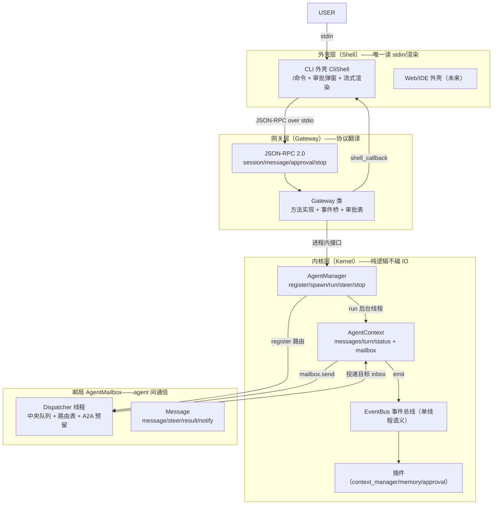

# 架构总览：三层协议 + 双事件流 + 邮局通信

日期：2026-08-29
来源：qi-agent 架构演进总结（内核/外壳分离 + AgentMailbox 邮局 + 事件驱动）
关联：26 号（同步架构生产演进）、27 号（并发模型演进教训）、
      AgentMailbox 中央队列方案（2026-08-29）、内核外壳分离方案（2026-08-28）

## 一、整体架构（三层 + 邮局 + 事件）



## 二、三层协议（各司其职——重点）

```
协议 1：外壳 ↔ 网关（JSON-RPC 2.0 over stdio）
  CLI 外壳 ←→ Gateway
  请求：session/create / message/send / approval/respond / session/stop
  通知：serverRequest/approval / item/agentMessage/delta / turn/end
  为什么 JSON-RPC 不用 HTTP：
    - 审批要【双向】（内核问 → 外壳答 → 回来）——HTTP 单向请求-响应做不到
    - 流式输出要【长连接】——HTTP 每请求建连开销大
    - 双向长连接 = 对讲机模式（一条管道持续传）
  自实现（~200 行）而非标准库：
    - 业界主流（Codex/DSH）自实现协议层（审批流/流式定制）
    - JSON-RPC 2.0 协议极简（请求/响应/通知 + 错误码）

协议 2：内核 ↔ 网关（进程内接口）
  Gateway 方法 → AgentManager.run/register/stop（进程内调用）
  内核事件 → shell_callback 转发（事件桥）
  签名【对齐 JSON-RPC 方法】——未来换传输（socket/WebSocket）不换接口
  （对齐 Codex App Server：stdio:// + socket:// 双 transport 同一协议）

协议 3：agent ↔ agent（邮局 Message）
  主 agent ←→ 子 agent（Dispatcher 中央队列路由）
  Message 三要素：id/sender/target（A2A 对齐）
  type：message(对话投递) / steer(控制) / result(结果) / notify(通知)
  target 未来可拓 ip:port:agent_id（A2A 远程寻址——ForeignMailbox 预留）

三层协议的分层价值：
  换传输不换协议（JSON-RPC stdio → socket 无缝）
  换语言不换协议（Python 内核 + 任意语言客户端）
  测试方便（echo JSON 消息直接喂进程）
```

## 三、双事件流（事件驱动逻辑——重点）

```
事件流 1：agent 生命周期（EventBus——单线程语义）
  Agent 循环 emit → 插件监听 → 横切逻辑

  agent/pre-step       → context_manager（压缩/裁剪检查）
                       → delegate_task（消费 steer/对话投递）
  agent/turn-start     → 轮次开始（审计/统计）
  agent/tool-approval  → approval_gate（审批弹窗）
  agent/final-answer   → 最终回答（流式输出/记忆提炼触发）
  agent/turn-end       → 轮次结束（统计）
  agent-manager/register → agent 上线（统一上报）

  → 插件是"观察者"——内核循环不感知插件（横切零侵入）
  → 单线程语义 = 同步/有序/无锁（不为并发付费）

事件流 2：跨线程通知（mailbox notify——避免污染事件总线）
  提炼线程 → mailbox.send(notify) → 主循环消费
  持久化线程 → mailbox.send(notify)
  → 事件总线保持单线程（跨线程 emit 是竞态源——27 号教训）
  → 跨线程通知走邮局（消息队列）——职责分离

为什么两条流（关键设计）：
  事件总线 = agent 生命周期内的【同步钩子】（插件横切——主循环内）
  邮局     = 跨线程/跨 agent 的【异步通信】（消息队列——线程安全）
  → 同步的走事件（有序），异步的走邮局（隔离）
  → 不为并发付费（事件总线不加锁——邮局天然线程安全）
```

## 四、邮局通信（agent 间——并发核心）

```
AgentMailbox（每 agent 一个——挂 AgentContext 上）：
  outbox → 引用中央队列（register 时绑定——send 一步入中央）
  inbox → 收件（Dispatcher 投来——归属者消费）

Dispatcher（独立 daemon 线程）：
  中央队列 = 所有消息汇聚（阻塞 get——零轮询 + FIFO）
  run()：central.get → 查路由表 → 目标 inbox.put
  _deliver 路由决策：本地 routes / 远程 foreign（A2A 预留）/ fail-closed
  优雅关停：stop 事件 + join 超时

控制面收口（2026-08-29）：
  steer → 走邮局（MessageType.STEER——消息流）
  stop → 保持 Event 信号（立即生效——信号不是消息流）
  → 职责分离：消息走邮箱（steer/result/message），信号走 Event（stop）

失败通知统一：
  常规失败 → _run_subagent 返回 {status: failed} → RESULT 投父
  意外崩溃 → except 分支 → RESULT(status=failed) 投父
  → 父 agent 不依赖 poll——所有失败推送通知（A2A 语义）
```

## 五、数据流全链路（一条消息的旅程）

```
用户输入 → ① 外壳读 stdin
CLI 外壳 → ② JSON-RPC {method: message/send}
Gateway → ③ 进程内调用 AgentManager.run
Agent 循环 → ④ 发 LLM（后台线程）
LLM 返回 tool_calls → ⑤ emit agent/tool-approval
approval_gate → ⑥ 网关 shell_callback → ⑦ 外壳弹窗
用户批准 → ⑧ approval/respond → ⑨ 内核继续
执行工具 → ⑩ 结果回填 → ⑪ 最终回答
流式 delta → ⑫ 通知 → 外壳渲染
```

## 六、与业界对照

```
Codex：Agent Core + App Server（JSON-RPC over stdio/socket）——
  我们的协议 1/2 = 同款（网关层 + 协议层）
DSH：inbox 队列（agent 间消息）+ 持久化事件流——
  我们的邮局 = 同款（Dispatcher 中央队列 + Message）
Hermes：事件单线程模型 + 平台层回调——
  我们的事件流 1 = 同款（EventBus 单线程 + 插件观察）
A2A（Google）：每 agent = 端点（agent card）——
  我们的邮局 = 本地实现（target 寻址 + foreign 预留）

共同点：内核/外壳分离 + 消息传递（不共享状态）+ 事件驱动
```

## 七、要点速记

```
1. 三层协议：JSON-RPC（外壳↔网关）/ 进程内接口（网关↔内核）/ Message（agent↔agent）
2. 双事件流：EventBus（agent 生命周期同步钩子）/ mailbox notify（跨线程异步）
3. 邮局 = 中央队列 + Dispatcher 线程（零轮询 + FIFO + A2A 预留）
4. 控制面：steer 走消息（邮局），stop 走信号（Event）——职责分离
5. 失败通知统一（RESULT 推送——父不依赖 poll）
6. 分层价值：换传输不换协议、内核/外壳解耦、并发隔离
```
