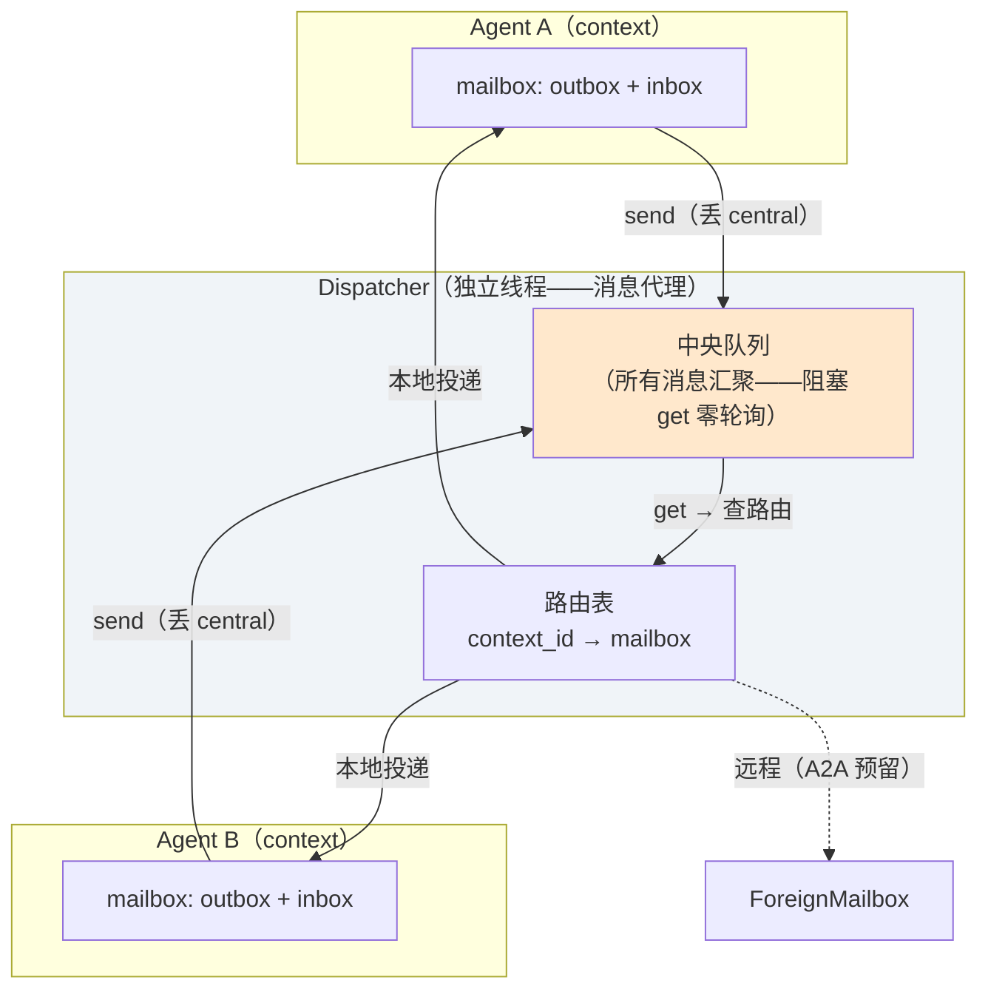
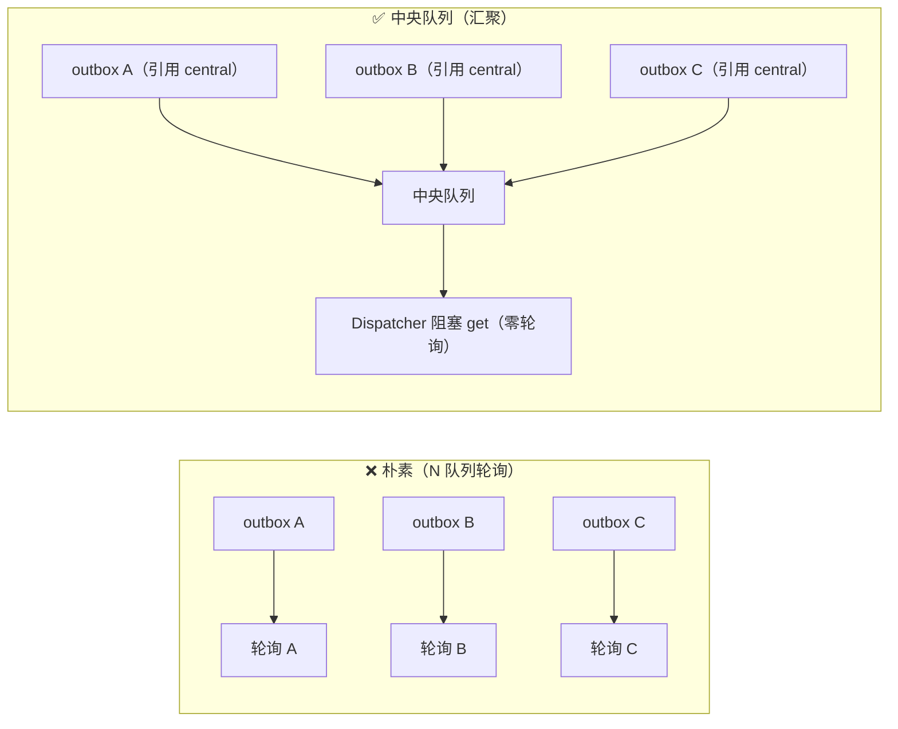
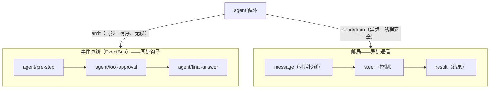
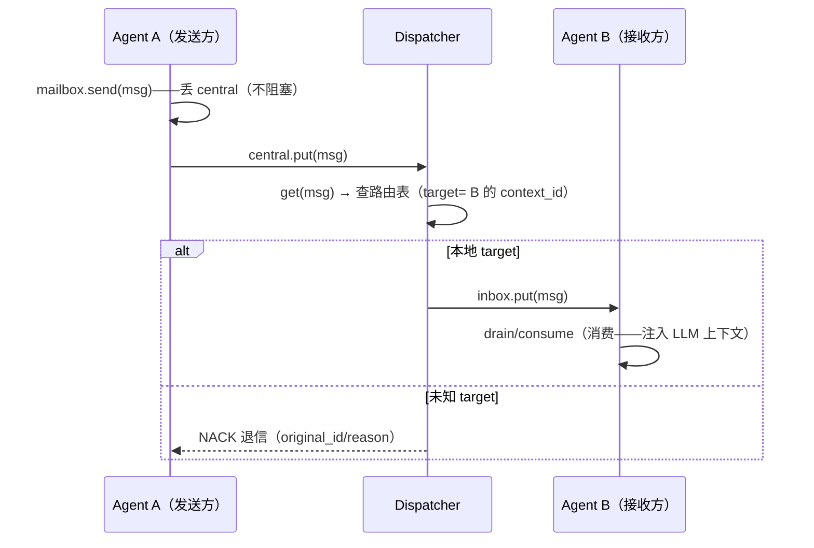

# Agent 通信模型：邮局架构（Message Broker 模式）

日期：2026-08-30
来源：qi-agent AgentMailbox 邮局模型 v3（中央队列演进）——agent 间通信的
      完整设计复盘（含面试亮点视角：为什么这样设计、业界对照、踩过的坑）

## 一、问题域：agent 之间怎么通信？

```
多 agent 系统（主 agent + 子 agent + 未来 team）需要：
  ① 对话投递：主 → 子（多轮指导）
  ② 控制指令：外部/父 → 目标（steer 改方向）
  ③ 结果回传：子 → 父（任务完成）
  ④ 失败通知：子 → 父（异常/超时）
  ⑤ 退信回执：投递失败 → 发送方（NACK）

朴素方案（散装通道）：
  steer 一个队列 + 结果一个回调 + 通知一个事件 → 每个通道独立实现
  → 问题：通道越来越多、语义混乱、无法统一审计
```

## 二、核心设计：邮局（AgentMailbox）——统一通信模型



```
核心组件：
  Message（统一消息——A2A 对齐）：
    id / sender / target / type / data / timestamp
    type: message(对话投递) / steer(控制) / result(结果) / notify(通知) / nack(退信)

  AgentMailbox（每 agent 一个——挂在 AgentContext 上）：
    outbox → 引用中央队列（register 时绑定——send 一步入中央）
    inbox → 收件（Dispatcher 投来——归属者消费）

  Dispatcher（独立 daemon 线程——消息代理）：
    中央队列（所有消息汇聚——阻塞 get 零轮询 + FIFO）
    路由表（context_id → mailbox——register/unregister 维护）
    _deliver：本地投递 / 远程 foreign（A2A 预留）/ 未知 → NACK 退信
```

## 三、关键设计决策（每个都是面试点）

### 3.1 为什么"中央队列"而不是"每 agent 一个队列 + 轮询"？

```
朴素方案：Dispatcher 监听 N 个 outbox 队列
  → 轮询 N 个队列（空轮询浪费 CPU）+ 单线程无法阻塞等多队列
  → N 大时是瓶颈（用户提出的关键质疑）

中央队列方案：
  所有 agent 的 outbox 都引用【同一个中央队列】（register 时绑定）
  → Dispatcher 只阻塞等【一个】队列（get——零轮询 + FIFO）
  → N 队列多路复用问题【消失】

类比：Kafka topic（汇聚）+ 消费者组（分发）——同一模式
  → "多路复用"的标准答案：把 N 个源合成一个入口
```



### 3.2 为什么"outbox 引用 central"而不是"独立 outbox + 搬运"？

```
用户拍板（设计评审）：outbox 不是独立队列——【直接引用 central】
  register 时赋值：mailbox.outbox = central
  → send = 丢 outbox = 丢 central（同一队列！一步入中央）
  → 消灭"独立 outbox + Dispatcher 再搬一次"的两步

收益：
  ① 概念保留（agent 视角"丢自己邮箱"——outbox 语义在）
  ② 物理最优（只有一个中央队列——Dispatcher 只等一个）
  ③ 未注册 send → RuntimeError（fail-fast——未上线的 agent 不该发消息）
```

### 3.3 为什么"异步投递"（Dispatcher 线程搬运）？

```
send 只做 put（不阻塞）→ Dispatcher 线程 get → 路由 → 目标 inbox.put
  → 发送方不阻塞（投递是异步的——消息代理模式）

同步 vs 异步的取舍：
  同步投递：调用方直接塞目标 inbox（简单但耦合——要知道目标引用）
  异步投递：send 丢中央 → Dispatcher 路由（解耦——发送方不知目标实现）
  → 异步 = 解耦（A2A 预留：未来远程投递 = 换 foreign 后端，发送方无感）
```

### 3.4 为什么"事件总线"和"邮局"分离？（双通道）



```
事件总线 = agent 生命周期内的【同步钩子】（插件横切——context_manager 裁剪/
  approval 审批/debug 日志）——单线程语义（不加锁、有序）

邮局 = 跨线程/跨 agent 的【异步通信】（消息队列——线程安全）

为什么分两条：
  ① 事件 = "本 agent 循环内的检查点"（同步——不跨线程）
  ② 邮局 = "agent 之间/跨线程"（异步——线程安全队列）
  → 不为并发付费：事件总线不加锁（单线程），邮局天然线程安全（队列）
  → 跨线程 emit 事件 = 竞态源（并发模型演进教训）——一律走邮局

控制面收口：
  steer → 走邮局（STEER 消息——下轮生效）
  stop → 保持 Event 信号（立即生效——中断语义，不是消息流）
  → 职责分离：消息走邮箱（steer/result/message），信号走 Event（stop）
```

### 3.5 为什么"NACK 退信"？（可靠投递）

```
未知 target 投递失败 → 不是静默丢弃（fail-closed）：
  → 回执 NACK 给发送方（退信语义——邮件类比）

  nack = Message(sender=dispatcher, target=原sender,
                 type=NACK, data={original_id, original_target, reason})

防递归：NACK 不再生成 NACK（target 不存在 → 直接审计）
  → 最多原始 + 1 回执（不会无限递归）

类比：寄信地址写错 → 邮局退信给你（不是扔了）
  → 发送方 drain 邮箱能看到"哪条消息没送到 + 为什么"
```

## 四、消息生命周期（完整旅程）



```
消费时机（每轮 pre-step——下轮生效）：
  agent 循环的 pre-step 事件 → context.consume_mailbox(messages)
    → drain_messages → [消息投递] 前缀
    → drain_steer → [引导] 前缀
    → 合并成一条 user（防连续 user 触发 LLM 400）
  → 主/子统一（Agent 构造时挂载——一处实现）
```

## 五、与业界对照

```
DSH（Agent Studio）：inbox 队列（agent 间消息）——我们同款
Kafka/RabbitMQ：消息代理（topic 汇聚 + 消费者分发）——中央队列同款
A2A（Google 2025）：每 agent = 端点（agent card）——我们 target 寻址对齐
  · A2A message 语义：id/sender/target——我们 Message 三要素同款
  · A2A 远程投递 = 我们 ForeignMailbox 预留（target 可拓 ip:port:agent_id）
Erlang actor：每进程一个 mailbox——我们同款（mailbox 隔离）
Hermes：事件单线程 + 平台回调——我们事件流 1 同款
```

## 六、踩过的坑（真实教训）

```
① 消费者互清空：drain_steer/drain_messages 共用 drain()（取空整个 inbox）
   → 先 drain_steer 连带清掉 MESSAGE（互不清空！）
   → 修复：drain_by_type（锁内遍历 + 非目标类型放回）
   → 教训：消费方法必须按类型隔离——不能全量取再过滤

② 主 agent 只收不读：mailbox 建了但主循环不消费（只有子 agent 消费）
   → steer 主 agent 无效（消息堆积）
   → 修复：Agent 构造时统一挂 pre-step 消费钩子（主/子一致）

③ 连续 user 注入：message + steer 同时存在 → 相邻两条 user
   → 可能触发 LLM 400（role 必须交替）
   → 修复：合并成一条 user（| 分隔）

④ 事件总线 context 未绑定：传入的 EventBus 没绑 context_id
   → 日志 context= 空（无法定位）
   → 修复：AgentContext 构造时补绑

⑤ 同步/异步路径分叉：工具路径（delegate_task）不走邮局
   → message.log 无记录（可观测缺口——设计决策：两场景各走各的）
```

## 七、面试要点速记

```
1. 统一通信模型：邮局（Message + mailbox + Dispatcher）——所有 agent 间通信
2. 中央队列：N 队列多路复用 → 汇聚一个（阻塞 get 零轮询 + FIFO）
3. outbox=central 引用：概念保留 + 物理最优（一步入中央）
4. 双通道分离：事件总线（同步钩子）+ 邮局（异步通信）——不为并发付费
5. NACK 退信：可靠投递（失败可感知）+ 防递归
6. A2A 预留：target 寻址 + ForeignMailbox（未来远程投递换后端）
7. 踩坑教训：消费互清空 / 主 agent 只收不读 / 连续 user / 上下文绑定
```
